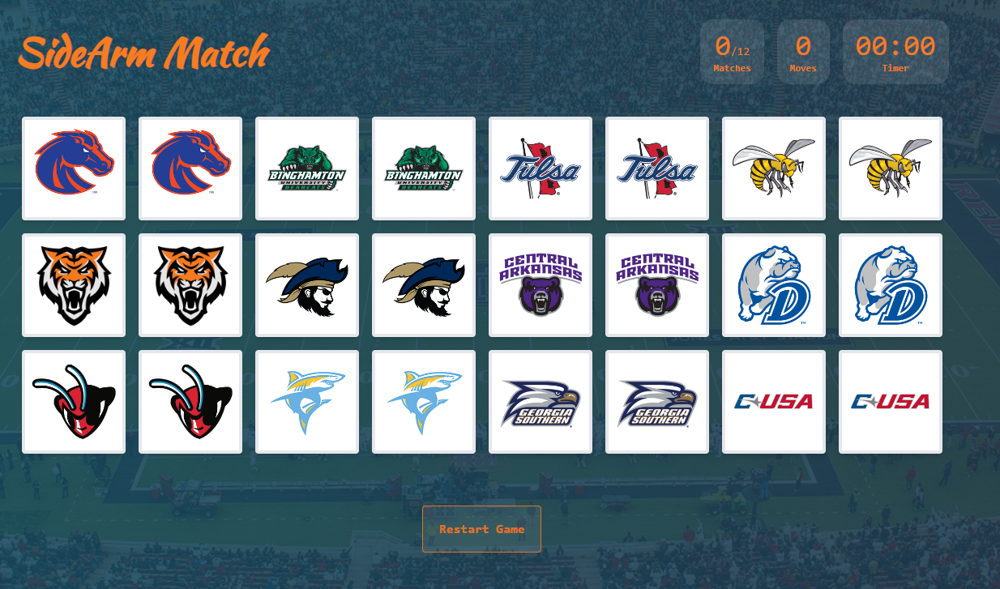

<h1 align="center">
  
</h1>

<p align="center">
  <a href="#-tecnologies">Tecnologies</a>&nbsp;&nbsp;&nbsp;|&nbsp;&nbsp;&nbsp;
  <a href="#-projet">Project</a>&nbsp;&nbsp;&nbsp;|&nbsp;&nbsp;&nbsp;
  <a href="#-layout">Layout</a>&nbsp;&nbsp;&nbsp;|&nbsp;&nbsp;&nbsp;
  <a href="#memo-license">License</a>&nbsp;&nbsp;&nbsp;|&nbsp;&nbsp;&nbsp;
  <a href="#run-project">Run the App</a>
</p>

<p align="center">
 

  
</p>

<br>

<p align="center">
  
</p>

## 💻 Project

This project `SideArm Match` is a memory game application, where it is measure the player moves and time to finish all pair matches cards. It was chosen the Vue3 framework in its new version to apply the composition API.

## 🚀 Tecnologies

This project was developed with:

- Vue 3 + Vite
- Tailwind CSS
- Dependencies PartyJs and Lottiefiles


## :memo: License

This project is MIT License.

## 🎫 Deploy

This project was deployed in [VERCEL](https://vercel.com/), and you can check the final result online in [this link](https://matchgame.vercel.app/).

## 🏍️ Run the project 

```
shell

//install Dependencies
npm install
or
yarn

//Run project
npm run dev
//or
yarn dev

```

❤️
